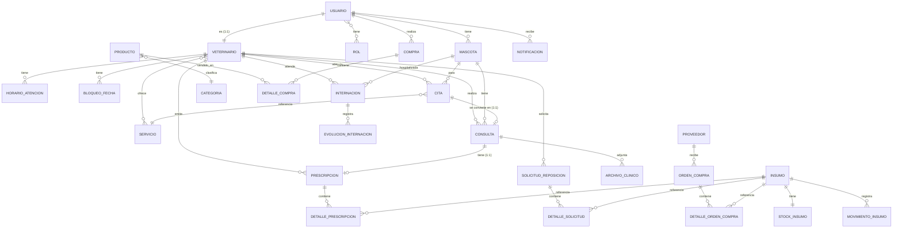

# G4-ms - PetStore E-Commerce Backend

Backend del proyecto **Pet Store** (e-commerce + gestión veterinaria) para la capacitación de GoTechy.

---

## Tabla de Contenidos

1. [Módulos del Sistema](#módulos-del-sistema)
2. [Stack Tecnológico](#stack-tecnológico)
3. [Inicio Rápido](#inicio-rápido)
4. [Configuración](#configuración)
5. [Base de Datos y Migraciones](#base-de-datos-y-migraciones)
6. [Autenticación y Roles](#autenticación-y-roles)
7. [Datos de Prueba (Seeds)](#datos-de-prueba-seeds)
8. [Referencia de Endpoints](#referencia-de-endpoints)
   - [Auth](#auth)
   - [E-Commerce](#e-commerce)
   - [Veterinaria (Consultas / Prescripciones / Citas / Internaciones)](#veterinaria)
   - [Vet-Stock (Insumos / Stock / Solicitudes / Órdenes / Proveedores)](#vet-stock)
   - [Vet-Admin (Veterinarios / Servicios / Horarios / Bloqueos)](#vet-admin)
   - [Notificaciones](#notificaciones)
   - [Usuarios y Perfil](#usuarios-y-perfil)
   - [Upload de Imágenes (Cloudinary)](#upload-de-imágenes-cloudinary)
9. [Modelo de Datos](#modelo-de-datos)
10. [Estructura del Proyecto](#estructura-del-proyecto)
11. [Documentación API (Swagger)](#documentación-api-swagger)

---

## Módulos del Sistema

| Módulo | Descripción | Roles |
|---|---|---|
| **E-Commerce** | Productos, categorías, carrito implícito vía compras, gestión de órdenes | `CLIENTE`, `ADMIN` |
| **Gestión Veterinaria** | Mascotas, historial clínico, consultas, prescripciones, citas, internaciones, notificaciones, archivos clínicos | `ADMIN`, `VETERINARIO` (alias `DOCTOR`), `CLIENTE` |
| **Vet-Stock** | Insumos médicos, stock, movimientos, solicitudes de reposición, órdenes de compra, proveedores, consumo | `ADMIN`, `VETERINARIO` |
| **Vet-Admin** | Alta/edición de veterinarios, catálogo de `Servicio`s, horarios, bloqueos de fecha | `ADMIN` |

> **Roles:** existen dos alias para veterinario — `ROLE_DOCTOR` y `ROLE_VETERINARIO` — ambos funcionan de forma intercambiable en el sistema.

---

## Stack Tecnológico

| Tecnología | Versión |
|---|---|
| Spring Boot | 3.4.13 |
| Java | 21 (LTS) |
| Spring Security | JWT (jjwt 0.12.6) |
| Spring Data JPA | - |
| PostgreSQL | 15 |
| Flyway | Core + flyway-database-postgresql |
| Springdoc OpenAPI | 2.8.4 (Swagger UI) |
| Cloudinary | cloudinary-http45 1.34.0 |
| Lombok | **No utilizado** (getters/setters manuales en todo el proyecto) |

---

## Inicio Rápido

### Requisitos
- Java 21+
- Maven 3.8+ (o usar `./mvnw`)
- PostgreSQL 15+ (o usar Docker)

### Pasos

1. **Configurar variables de entorno** (ver [Configuración](#configuración)).

2. **Levantar la base de datos con Docker:**
   ```bash
   docker compose up -d
   ```

3. **Levantar la aplicación:**
   ```bash
   ./mvnw spring-boot:run
   ```

   O en Windows con el script automático:
   ```powershell
   .\dev-up.ps1
   ```

4. **Verificar:** la API queda en `http://localhost:8080`. Swagger UI en `http://localhost:8080/swagger-ui.html`.

> **Tip Windows:** si el puerto está ocupado o el JAR queda bloqueado:
> ```powershell
> Get-Process -Name java | Stop-Process -Force
> ```

---

## Configuración

Variables de entorno (soportadas vía `.env` + `dev-up.ps1`):

```bash
# Base de datos
DB_HOST=localhost
DB_PORT=5432
DB_NAME=petshop_ecommerce
DB_USER=petshop_admin
DB_PASSWORD=petshop_secure_pass

# JWT (HMAC-SHA, 256 bits mínimo)
JWT_SECRET=PETSHOP_SECRET_KEY_256_BITS_MIN_FOR_HS256_ALGORITHM_2026

# Cloudinary (uploads de imágenes)
CLOUDINARY_CLOUD_NAME=your_cloud_name
CLOUDINARY_API_KEY=your_api_key
CLOUDINARY_API_SECRET=your_api_secret
```

**CORS:** habilitado solo para `http://localhost:4200` (Angular dev server) con credenciales.

**Puerto:** `8080` (configurable vía `server.port`).

**Uploads estáticos:** la carpeta `${app.upload.dir:uploads}` se expone en `/uploads/**`.

---

## Base de Datos y Migraciones

Flyway ejecuta **30 migraciones** en orden desde `src/main/resources/db/migration/`:

| Rango | Descripción |
|---|---|
| V1–V3 | Roles, usuarios, join `usuarios_roles` |
| V4–V7 | Categorías, productos, compras y detalles |
| V8 | Mascotas |
| V9–V10 | Imagen y unidad de medida en productos |
| V11–V12 | Seeds de roles `DOCTOR` y `VETERINARIO` |
| V13 | Proveedores |
| V14–V18 | Insumos, stock, movimientos, solicitudes de reposición, órdenes de compra |
| V19 | Notificaciones |
| V20–V23 | Veterinarios, horarios, bloqueos |
| V24 | Citas |
| V25 | `peso_kg` en productos |
| V26 | Tabla `servicios` (catálogo comercial) |
| V27 | Drop de la join-table vieja `veterinario_servicios` |
| V28 | Re-crea `servicio_veterinario` (join correcta) |
| V29 | Migra `citas.tipo` (enum viejo) → `citas.servicio_id` (FK) |
| V30 | Agrega `motivo_cancelacion` a citas |

> **Importante:** la tabla `citas` ya no tiene el campo `tipo_cita` (eliminado en V29). El campo `servicio_id` (FK a `servicios`) es el único válido.

---

## Autenticación y Roles

- **JWT en header:** `Authorization: Bearer <token>`
- **Expiración:** 24 h (`app.jwt.expiration-ms=86400000`)
- **Algoritmo:** HMAC-SHA (configurable vía `app.jwt.secret`)
- **Roles disponibles:**
  - `ROLE_ADMIN`
  - `ROLE_VETERINARIO` (= `ROLE_DOCTOR`, ambos válidos)
  - `ROLE_CLIENTE`

**Endpoints públicos** (no requieren token):
- `POST /auth/login`, `POST /auth/register`, `GET /auth/check-email`
- `GET /productos/**`
- `GET /categorias/**`
- `GET /insumos/stock/disponibles`
- `GET /api/v1/mascotas` (lista completa — usado por el frontend público)
- Swagger: `/swagger-ui/**`, `/v3/api-docs/**`, `/api-docs/**`

Todo lo demás requiere JWT. Las anotaciones `@PreAuthorize` están a nivel de método en cada controller.

---

## Datos de Prueba (Seeds)

`DataSeederConfig` crea automáticamente al iniciar (solo fuera del perfil `test`):

### Usuarios
| Email | Password | Rol | Datos extra |
|---|---|---|---|
| `admin@petshop.com` | `12345678` | `ADMIN` | — |
| `doctor@petshop.com` | `12345678` | `VETERINARIO` | Perfil `Veterinario`: matrícula `VET-12345`, especialidad `Clínica General` |
| `cliente@petshop.com` | `12345678` | `CLIENTE` | 2 mascotas: **Max** (Perro, Macho), **Nube** (Gato, Hembra) |

### Proveedores
- Distribuidora Medica ABC — `ventas@distmedicaabc.com`
- Farmacia Veterinaria Norte — `info@farmavetnorte.com`
- Insumos Veterinarios del Sur — `pedidos@ivsur.com`

### Insumos (10, con stock inicial)
Vacuna Antirrabica, Vacuna Sextuple, Vacuna Triple Felina, Antibiótico Amoxicilina, Antiparasitario Ivermectina, Suero Fisiológico, Gasas Estériles, Jeringas 5ml, Anestésico Ketamina, Antiinflamatorio Meloxicam.

---

## Referencia de Endpoints

> **Convención:** los endpoints bajo `/api/v1/*` están versionados; los demás (`/auth`, `/productos`, `/compras`, `/insumos`, etc.) no lo están.

### Auth

| Método | Ruta | Auth | Descripción |
|---|---|---|---|
| `POST` | `/auth/login` | Público | Login. Devuelve `AuthResponse` con `token` JWT. |
| `POST` | `/auth/register` | Público | Registro de cliente. Si `cantidadMascotas >= 3`, `familyName` es obligatorio. Acepta mascotas iniciales. |
| `GET` | `/auth/check-email?email=` | Público | Devuelve `true` si el email ya está registrado. |

**`LoginRequest`:** `email` (`@NotBlank @Email`), `password` (`@NotBlank`).

**`RegisterRequest`:** `nombre`, `apellido`, `edad`, `avatar`, `direccion`, `celular`, `email`, `password` (min 6), `cantidadMascotas` (default 0), `familyName`, `mascotas: List<MascotaRequest>`.

**`AuthResponse`:** `id`, `nombre`, `apellido`, `avatar`, `direccion`, `celular`, `email`, `token`, `nombreMascota`, `tipoMascota`, `cantidadMascotas`.

---

### E-Commerce

#### Categorías (`/categorias`)

| Método | Ruta | Auth | Descripción |
|---|---|---|---|
| `GET` | `/categorias` | Público | Lista todas las categorías. |
| `GET` | `/categorias/{id}` | Público | Obtiene una categoría. |
| `POST` | `/categorias` | Público (⚠️) | Crea categoría. Body: `{ "nombre", "descripcion" }` (DTO interno). |
| `PUT` | `/categorias/{id}` | Público (⚠️) | Actualiza categoría. |
| `DELETE` | `/categorias/{id}` | Público (⚠️) | Elimina categoría. |

> ⚠️ Los endpoints de escritura de categorías **no tienen `@PreAuthorize`**. Considerar protegerlos a `ADMIN` antes de producción.

#### Productos (`/productos`)

| Método | Ruta | Auth | Descripción |
|---|---|---|---|
| `GET` | `/productos?categoriaId=` | Público | Lista productos. Filtro opcional por `categoriaId`. |
| `GET` | `/productos/{id}` | Público | Obtiene un producto. |
| `POST` | `/productos` | `ADMIN` | Crea producto. |
| `PUT` | `/productos/{id}` | `ADMIN` | Actualiza producto. |
| `DELETE` | `/productos/{id}` | `ADMIN` | Elimina producto. |

**`ProductoRequest`:** `nombre`, `codigo`, `descripcion`, `precio` (`@DecimalMin(0.01)`), `stock` (`@Min(0)`), `unidadMedida`, `categoriaId`, `imagenUrl`, `pesoKg`.

**`ProductoResponse`:** incluye `id`, `categoria` (nombre), `activo`, `fechaCreacion`.

#### Compras (`/compras`)

| Método | Ruta | Auth | Descripción |
|---|---|---|---|
| `POST` | `/compras` | Auth | Crea compra para el usuario autenticado. Descuenta stock automáticamente. |
| `GET` | `/compras` | Auth | Historial del usuario autenticado. |
| `GET` | `/compras/usuario/{usuarioId}` | `ADMIN` | Historial de un usuario. |
| `GET` | `/compras/todas` | `ADMIN` | Todas las compras del sistema. |
| `PUT` | `/compras/{id}/estado?estado=` | `ADMIN` | Cambia estado. Valores: `PENDIENTE`, `CONFIRMADO`, `ENTREGADO`, `CANCELADO`. **Al pasar a `CANCELADO` el stock se restaura automáticamente.** |

**`CompraRequest`:** `metodoPago` (string), `productos: List<{ productoId, cantidad >= 1 }>`.

**`CompraResponse`:** `id`, `usuarioId`, `fecha`, `total`, `metodoPago`, `estado`, `productos: List<{ productoId, nombre, cantidad, precioUnitario }>`.

**Estados (`EstadoCompra`):** `PENDIENTE`, `CONFIRMADO`, `ENTREGADO`, `CANCELADO`.

---

### Veterinaria

#### Mascotas (`/api/v1/mascotas`)

| Método | Ruta | Auth | Descripción |
|---|---|---|---|
| `GET` | `/api/v1/mascotas` | **Público** | Lista **todas** las mascotas del sistema. |
| `GET` | `/api/v1/mascotas/mis-mascotas` | Auth | Mascotas del usuario autenticado. |
| `PUT` | `/api/v1/mascotas/{id}` | Auth | Actualiza mascota. Solo el dueño o roles `ADMIN`/`VETERINARIO`/`DOCTOR` pueden. Acepta `MascotaResponse` como body; solo se actualizan campos no nulos. |
| `GET` | `/api/v1/mascotas/{mascotaId}/prescripciones` | Auth | Lista prescripciones de una mascota. |

**`MascotaResponse`:** `id`, `nombre`, `sexo`, `tipo`, `raza`, `fechaNacimiento`, `peso`. (También se usa como request del PUT.)

#### Historial Clínico (`/api/v1/mascotas`)

| Método | Ruta | Auth | Descripción |
|---|---|---|---|
| `GET` | `/api/v1/mascotas/{id}/historial-clinico?page=&size=&sort=` | `ADMIN`, `VETERINARIO`, `CLIENTE` | Historial paginado de consultas de la mascota. |

#### Consultas (`/api/v1/consultas`)

| Método | Ruta | Auth | Descripción |
|---|---|---|---|
| `POST` | `/api/v1/consultas` | `ADMIN`, `VETERINARIO` | Registra consulta. |
| `GET` | `/api/v1/consultas/{id}` | `ADMIN`, `VETERINARIO` | Obtiene consulta. |
| `POST` | `/api/v1/consultas/{id}/prescripcion` | `ADMIN`, `VETERINARIO` | Agrega prescripción a la consulta. |
| `GET` | `/api/v1/consultas/{id}/prescripcion` | `ADMIN`, `VETERINARIO` | Obtiene la prescripción de la consulta. |

> **Nota:** el README previo listaba `PUT` y `DELETE` para consultas que **no existen** en el código.

**`ConsultaRequest`:** `citaId` (opcional), `mascotaId`, `veterinarioId`, `motivo`, `anamnesis`, `examenFisico`, `diagnostico`, `tratamiento`, `peso` (BigDecimal), `temperatura`, `frecuenciaCardiaca`, `frecuenciaRespiratoria`, `trc`, `notas`.

**`PrescripcionRequest`:** `consultaId`, `observaciones`, `detalles: List<DetallePrescripcionRequest>`.

**`DetallePrescripcionRequest`:** `insumoId`, `dosis`, `frecuencia`, `duracion` (los tres `@NotBlank`), `viaAdministracion`, `instrucciones`.

#### Citas (`/api/v1/citas`)

| Método | Ruta | Auth | Descripción |
|---|---|---|---|
| `POST` | `/api/v1/citas` | `ADMIN`, `VETERINARIO`, `CLIENTE` | Crea cita. **Valida que el veterinario ofrezca el `servicioId`**. |
| `GET` | `/api/v1/citas/{id}` | `ADMIN`, `VETERINARIO` | Obtiene cita. |
| `GET` | `/api/v1/citas?veterinarioId=&fecha=YYYY-MM-DD` | `ADMIN`, `VETERINARIO`, `CLIENTE` | Agenda de un veterinario en un día. |
| `GET` | `/api/v1/citas/agenda/mes?veterinarioId=&mes=YYYY-MM` | `ADMIN`, `VETERINARIO` | Agenda mensual. |
| `GET` | `/api/v1/citas/todas?veterinarioId=` | `ADMIN`, `VETERINARIO` | Todas las citas del veterinario. |
| `PATCH` | `/api/v1/citas/{id}/estado` | `ADMIN`, `VETERINARIO` | Cambia estado. Body: `EstadoCitaRequest`. |
| `GET` | `/api/v1/citas/mis-citas` | `CLIENTE` | Citas del cliente autenticado. |
| `PATCH` | `/api/v1/citas/{id}/pagar` | `CLIENTE` | Marca la cita como pagada. |

**`CitaRequest`:** `mascotaId`, `veterinarioId`, `servicioId` (`@NotNull`), `fechaHora` (LocalDateTime), `duracionMinutos` (default 30), `notas`.

**`EstadoCitaRequest`:** `estado` (enum `EstadoCita`), `motivo` (string, se guarda en `motivoCancelacion`).

**`CitaResponse`:** `id`, `mascotaId`, `mascotaNombre`, `veterinarioId`, `veterinarioNombre`, `veterinarioAvatar`, `clienteId`, `clienteNombre`, `servicio: ServicioResponse`, `fechaHora`, `duracionMinutos`, `estado`, `notas`, `motivoCancelacion`, `fechaCreacion`, `pagado`.

**Estados (`EstadoCita`):** `PENDIENTE`, `CONFIRMADA`, `EN_PROGRESO`, `COMPLETADA`, `CANCELADA`, `CANCELADA_POR_MEDICO`, `NO_ASISTIO`.

#### Internaciones (`/api/v1/internaciones`)

| Método | Ruta | Auth | Descripción |
|---|---|---|---|
| `POST` | `/api/v1/internaciones` | `ADMIN`, `VETERINARIO` | Ingresa mascota. Body: `InternacionRequest`. |
| `GET` | `/api/v1/internaciones/activas` | `ADMIN`, `VETERINARIO` | Lista internaciones activas. |
| `POST` | `/api/v1/internaciones/{id}/evolucion` | `ADMIN`, `VETERINARIO` | Registra evolución clínica. Body: `EvolucionRequest`. |
| `PATCH` | `/api/v1/internaciones/{id}/alta` | `ADMIN`, `VETERINARIO` | Da de alta. Body opcional: `AltaRequest { indicacionesAlta }`. |
| `GET` | `/api/v1/internaciones/pendientes-reingreso` | `ADMIN`, `VETERINARIO` | Lista con reingreso solicitado. |
| `GET` | `/api/v1/internaciones/mascota/{mascotaId}` | Auth | Por mascota. |
| `POST` | `/api/v1/internaciones/solicitar-reingreso` | Auth | Cualquier usuario puede solicitar. Body: `ReingresoRequest { mascotaId, notasCliente }`. |
| `PATCH` | `/api/v1/internaciones/{id}/confirmar-reingreso?jaulaId=` | `ADMIN`, `VETERINARIO` | Confirma reingreso asignando jaula. |

**`InternacionRequest`:** `mascotaId`, `veterinarioId`, `motivo`, `jaulaId`, `notas`.

**`EvolucionRequest`:** `observacion`, `peso`, `temperatura`.

**`InternacionResponse`:** `id`, `mascotaId`, `mascotaNombre`, `veterinarioId`, `veterinarioNombre`, `motivo`, `fechaIngreso`, `fechaAlta`, `jaulaId`, `estado`, `notas`, `indicacionesAlta`, `notasCliente`, `evoluciones: List<EvolucionResponse>`.

**Estados (`EstadoInternacion`):** `ACTIVA`, `ALTA`, `REINGRESO_SOLICITADO`.

---

### Vet-Stock

> Los paths `/insumos` y `/insumos/*` están repartidos entre `InsumoController` (CRUD del catálogo) y `StockInsumoController` (stock, movimientos, consumo). No hay colisión.

#### Insumos — Catálogo (`/insumos`)

| Método | Ruta | Auth | Descripción |
|---|---|---|---|
| `GET` | `/insumos` | `ADMIN`, `VETERINARIO` | Lista insumos activos. |
| `GET` | `/insumos/{id}` | `ADMIN`, `VETERINARIO` | Obtiene insumo. |
| `POST` | `/insumos` | `ADMIN` | Crea insumo (crea su `StockInsumo` en 0). |
| `PUT` | `/insumos/{id}` | `ADMIN` | Actualiza. |
| `DELETE` | `/insumos/{id}` | `ADMIN` | **Soft delete** (`activo=false`). |

**`InsumoRequest`:** `nombre`, `descripcion`, `unidadMedida`, `precioUnitario` (`@DecimalMin(0.01)`), `stockMinimo` (`@Min(0)`).

#### Stock (`/insumos/stock`)

| Método | Ruta | Auth | Descripción |
|---|---|---|---|
| `GET` | `/insumos/stock` | `ADMIN`, `VETERINARIO` | Stock de todos los insumos. |
| `GET` | `/insumos/stock/{id}` | `ADMIN`, `VETERINARIO` | Stock de un insumo. |
| `GET` | `/insumos/stock/{id}/historial` | `ADMIN`, `VETERINARIO` | Historial de movimientos. |
| `GET` | `/insumos/stock/disponibles` | **Público** | Stock para mostrar en frontend. |
| `POST` | `/insumos/consumo` | `VETERINARIO` | Registra consumo. Body: `ConsumoRequest`. |

**`ConsumoRequest`:** `items: List<{ insumoId, cantidad >= 1 }>`, `descripcion`.

**`StockInsumoResponse`:** `insumoId`, `nombreInsumo`, `cantidadActual`, `stockMinimo`, **`alertaStock`** (true si `cantidadActual <= stockMinimo`), `unidadMedida`, `precioUnitario`.

**`MovimientoInsumoResponse`:** `id`, `insumoId`, `nombreInsumo`, `tipo` (`ENTRADA`/`SALIDA`), `cantidad`, `precioUnitario`, `fecha`, `descripcion`, `referenciaId`.

#### Solicitudes de Reposición (`/solicitudes`)

| Método | Ruta | Auth | Descripción |
|---|---|---|---|
| `GET` | `/solicitudes` | `VETERINARIO` | Mis solicitudes (del veterinario autenticado). |
| `GET` | `/solicitudes/todas` | `ADMIN` | Todas. |
| `GET` | `/solicitudes/veterinario/{veterinarioId}` | `ADMIN` | Por veterinario. |
| `GET` | `/solicitudes/{id}` | `ADMIN`, `VETERINARIO` | Por id. |
| `POST` | `/solicitudes` | `VETERINARIO` | Crea solicitud. Body: `SolicitudReposicionRequest`. |
| `PUT` | `/solicitudes/{id}/aprobar?proveedorId=` | `ADMIN` | Aprueba y **genera automáticamente una `OrdenCompra`**. |
| `PUT` | `/solicitudes/{id}/cancelar` | `ADMIN` | Cancela (solo si `PENDIENTE`). |

**`SolicitudReposicionRequest`:** `detalles: List<{ insumoId, cantidadSolicitada >= 1 }>`.

**Estados (`EstadoSolicitud`):** `PENDIENTE`, `APROBADA`, `CANCELADA`.

#### Órdenes de Compra (`/ordenes-compra`)

| Método | Ruta | Auth | Descripción |
|---|---|---|---|
| `GET` | `/ordenes-compra` | `ADMIN` | Lista todas. |
| `POST` | `/ordenes-compra` | `ADMIN` | Crea orden directamente. Body: `OrdenCompraRequest`. |
| `GET` | `/ordenes-compra/{id}` | `ADMIN` | Por id. |
| `PUT` | `/ordenes-compra/{id}/completar` | `ADMIN` | Completa (recibe mercadería). Body: `OrdenCompraCompletarRequest`. Actualiza precios reales y stock. |
| `PUT` | `/ordenes-compra/{id}/cancelar` | `ADMIN` | Cancela (solo si `PENDIENTE`). |

**`OrdenCompraRequest`:** `proveedorId`, `items: List<{ insumoId, cantidad >= 1 }>`. Se crea en `PENDIENTE` con precios en 0.

**`OrdenCompraCompletarRequest`:** `items: List<{ insumoId, cantidad, precioUnitario }>`. El precio del insumo se actualiza con el real.

**Estados (`EstadoOrdenCompra`):** `PENDIENTE`, `COMPLETADA`, `CANCELADA`.

#### Proveedores (`/proveedores`)

| Método | Ruta | Auth | Descripción |
|---|---|---|---|
| `GET` | `/proveedores` | `ADMIN` | Lista activos. |
| `GET` | `/proveedores/{id}` | `ADMIN` | Por id. |
| `POST` | `/proveedores` | `ADMIN` | Crea. |
| `PUT` | `/proveedores/{id}` | `ADMIN` | Actualiza. |
| `DELETE` | `/proveedores/{id}` | `ADMIN` | **Soft delete**. |

**`ProveedorRequest`:** `nombre` (`@NotBlank @Size(max=150)`), `email`, `telefono`.

---

### Vet-Admin

#### Veterinarios (`/api/v1/veterinarios`)

| Método | Ruta | Auth | Descripción |
|---|---|---|---|
| `GET` | `/api/v1/veterinarios` | Auth | Lista veterinarios **activos**. |
| `GET` | `/api/v1/veterinarios/todos` | `ADMIN` | Lista todos (activos + inactivos). |
| `GET` | `/api/v1/veterinarios/{id}` | `ADMIN` | Por id. |
| `POST` | `/api/v1/veterinarios` | `ADMIN` | Crea veterinario (incluye cuenta de usuario). |
| `PUT` | `/api/v1/veterinarios/{id}` | `ADMIN` | Actualiza. |
| `DELETE` | `/api/v1/veterinarios/{id}` | `ADMIN` | **Soft delete**. |
| `PATCH` | `/api/v1/veterinarios/{id}/activo` | `ADMIN` | Activa/desactiva. Body: `CambiarEstadoRequest { activo: Boolean }`. |
| `GET` | `/api/v1/veterinarios/{id}/horarios` | `ADMIN` | Lista horarios. |
| `PUT` | `/api/v1/veterinarios/{id}/horarios` | `ADMIN` | Reemplaza los 7 días. |
| `GET` | `/api/v1/veterinarios/{id}/bloqueos` | `ADMIN` | Lista bloqueos. |
| `POST` | `/api/v1/veterinarios/{id}/bloqueos` | `ADMIN` | Crea bloqueo. Rechaza fechas solapadas. |
| `DELETE` | `/api/v1/veterinarios/{id}/bloqueos/{bloqueoId}` | `ADMIN` | Elimina bloqueo. |

**`VeterinarioRequest`:** `nombre`, `apellido`, `email`, `password` (min 6), `telefono`, `matricula` (único), `especialidad`, `bio`, `servicioIds: Set<Long>` (de `Servicio`s existentes en el catálogo).

**`VeterinarioResponse`:** `id`, `usuarioId`, `nombreCompleto`, `avatar`, `email`, `telefono`, `matricula`, `especialidad`, `bio`, `activo`, **`servicios: Set<ServicioResponse>`**, `fechaCreacion`.

#### Servicios (`/api/v1/servicios`)

| Método | Ruta | Auth | Descripción |
|---|---|---|---|
| `POST` | `/api/v1/servicios` | `ADMIN` | Crea servicio. |
| `GET` | `/api/v1/servicios` | `ADMIN`, `VETERINARIO`, `CLIENTE` | Lista todos. |
| `PUT` | `/api/v1/servicios/{id}` | `ADMIN` | Actualiza. |
| `DELETE` | `/api/v1/servicios/{id}` | `ADMIN` | Elimina. |
| `GET` | `/api/v1/servicios/veterinarios` | `ADMIN` | Lista todos los veterinarios (usado para asignar). |
| `GET` | `/api/v1/servicios/veterinario/{veterinarioId}` | `ADMIN`, `VETERINARIO`, `CLIENTE` | Servicios ofrecidos por un veterinario. |

**`ServicioRequest`:** `nombre`, `descripcion`, `precio`, `veterinarioIds: List<Long>`.

**`ServicioResponse`:** `id`, `nombre`, `descripcion`, `precio`, `veterinarios: List<VeterinarioResponse>`.

#### Horarios de Atención

Cuerpo de `PUT /api/v1/veterinarios/{id}/horarios`:

```json
{
  "horarios": [
    { "diaSemana": 1, "trabaja": true, "horaInicio": "08:00", "horaFin": "12:00" },
    { "diaSemana": 1, "trabaja": true, "horaInicio": "14:00", "horaFin": "18:00" },
    { "diaSemana": 2, "trabaja": true, "horaInicio": "08:00", "horaFin": "16:00" },
    { "diaSemana": 3, "trabaja": true, "horaInicio": "08:00", "horaFin": "16:00" },
    { "diaSemana": 4, "trabaja": true, "horaInicio": "08:00", "horaFin": "16:00" },
    { "diaSemana": 5, "trabaja": true, "horaInicio": "08:00", "horaFin": "14:00" },
    { "diaSemana": 6, "trabaja": false },
    { "diaSemana": 7, "trabaja": false }
  ]
}
```

#### Bloqueos de Fecha

Cuerpo de `POST /api/v1/veterinarios/{id}/bloqueos`:

```json
{ "fechaInicio": "2026-07-10", "fechaFin": "2026-07-15", "motivo": "Vacaciones anuales" }
```

---

### Notificaciones

Base: `/api/v1/notificaciones`

| Método | Ruta | Auth | Descripción |
|---|---|---|---|
| `GET` | `/api/v1/notificaciones` | Auth | Mis notificaciones. |
| `GET` | `/api/v1/notificaciones/no-leidas` | Auth | Solo no leídas. |
| `GET` | `/api/v1/notificaciones/sin-leer/cantidad` | Auth | Devuelve `{ "cantidad": <long> }`. |
| `PATCH` | `/api/v1/notificaciones/{id}/leer` | Auth | Marca una como leída. |
| `PATCH` | `/api/v1/notificaciones/marcar-todas-leidas` | Auth | Marca todas. Devuelve `{ "mensaje": "..." }`. |

**`NotificacionResponse`:** `id`, `titulo`, `mensaje`, `tipo`, `leido`, `fechaCreacion`.

**Tipos (`TipoNotificacion`):** `SISTEMA`, `WHATSAPP`, `EMAIL`.

---

### Usuarios y Perfil

Base: `/usuario`

| Método | Ruta | Auth | Descripción |
|---|---|---|---|
| `GET` | `/usuario/perfil` | Auth | Perfil del usuario autenticado (sin roles). |
| `PUT` | `/usuario/avatar` | Auth | Sube avatar (multipart, `file`, máx 5MB). Devuelve `{ "url": "..." }`. |
| `GET` | `/usuario/list` | `ADMIN` | Lista todos los usuarios (con roles). |
| `PUT` | `/usuario/admin/{id}/avatar` | `ADMIN` | Sube avatar de cualquier usuario. |

**`UsuarioPerfilResponse` (DTO interno en `UsuarioController`):** `id`, `nombre`, `apellido`, `email`, `avatar`, `direccion`, `celular`, `roles: Set<String>` (opcional, solo en `list`).

---

### Upload de Imágenes (Cloudinary)

Base: `/upload`

| Método | Ruta | Auth | Descripción |
|---|---|---|---|
| `POST` | `/upload/producto` | `ADMIN` | Sube imagen de producto. |
| `POST` | `/upload/avatar` | Auth | Sube avatar. |
| `POST` | `/upload/mascota` | Auth | Sube imagen de mascota. |

Todos reciben `multipart/form-data` con campo `file`. Devuelven `{ "url": "<cloudinary-url>" }`.

> Para avatares por defecto, `CloudinaryConfig` define URLs para los roles `admin`, `doctor` y `cliente` (configurables en `application.yml`).

---

## Modelo de Datos



### Enums

| Enum | Valores |
|---|---|
| `EstadoCompra` | `PENDIENTE`, `CONFIRMADO`, `ENTREGADO`, `CANCELADO` |
| `EstadoCita` | `PENDIENTE`, `CONFIRMADA`, `EN_PROGRESO`, `COMPLETADA`, `CANCELADA`, `CANCELADA_POR_MEDICO`, `NO_ASISTIO` |
| `EstadoInternacion` | `ACTIVA`, `ALTA`, `REINGRESO_SOLICITADO` |
| `EstadoSolicitud` | `PENDIENTE`, `APROBADA`, `CANCELADA` |
| `EstadoOrdenCompra` | `PENDIENTE`, `COMPLETADA`, `CANCELADA` |
| `MetodoPago` | `TRANSFERENCIA`, `EFECTIVO`, `TARJETA` |
| `TipoMovimiento` | `ENTRADA`, `SALIDA` |
| `TipoNotificacion` | `SISTEMA`, `WHATSAPP`, `EMAIL` |
| `UnidadMedida` | `G`, `KG`, `ML`, `L`, `UNIDAD` (con campo `simbolo`) |
| `TipoCita` | ⚠️ **Deprecated**: existe en código pero no se usa en ninguna entidad (migrado a `Servicio` en V29). Conservar solo si se referencia desde algún endpoint legacy. |

---

## Estructura del Proyecto

```
src/main/java/com/team4/petstore/
├── config/
│   ├── CloudinaryConfig.java
│   ├── DataSeederConfig.java
│   ├── OpenApiConfig.java
│   ├── SecurityConfig.java
│   └── WebConfig.java
├── controller/                     # 19 controllers
│   ├── AuthController.java
│   ├── CategoriaController.java
│   ├── CitaController.java
│   ├── CompraController.java
│   ├── ConsultaController.java
│   ├── ImageController.java
│   ├── InsumoController.java
│   ├── InternacionController.java
│   ├── MascotaController.java
│   ├── MascotaHistorialController.java
│   ├── NotificacionController.java
│   ├── OrdenCompraController.java
│   ├── ProductoController.java
│   ├── ProveedorController.java
│   ├── ServicioController.java
│   ├── SolicitudReposicionController.java
│   ├── StockInsumoController.java
│   ├── UsuarioController.java
│   └── VeterinarioController.java
├── dto/
│   ├── request/                    # 27 DTOs de entrada
│   │   ├── AltaRequest.java
│   │   ├── BloqueoFechaRequest.java
│   │   ├── CambiarEstadoRequest.java
│   │   ├── CitaRequest.java
│   │   ├── CompraRequest.java
│   │   ├── ConsultaRequest.java
│   │   ├── ConsumoRequest.java
│   │   ├── DetallePrescripcionRequest.java
│   │   ├── EstadoCitaRequest.java
│   │   ├── EvolucionRequest.java
│   │   ├── HorarioRequest.java
│   │   ├── InsumoRequest.java
│   │   ├── InternacionRequest.java
│   │   ├── LoginRequest.java
│   │   ├── MascotaRequest.java
│   │   ├── OrdenCompraCompletarRequest.java
│   │   ├── OrdenCompraRequest.java
│   │   ├── PrescripcionRequest.java
│   │   ├── ProductoRequest.java
│   │   ├── ProveedorRequest.java
│   │   ├── RegisterRequest.java
│   │   ├── ReingresoRequest.java
│   │   ├── ServicioRequest.java
│   │   ├── SolicitudReposicionRequest.java
│   │   ├── VeterinarioCuentaRequest.java
│   │   ├── VeterinarioPerfilRequest.java        # ⚠️ No usado por controllers
│   │   └── VeterinarioRequest.java
│   └── response/                   # 22 DTOs de salida
│       ├── ApiResponse.java
│       ├── AuthResponse.java
│       ├── BloqueoFechaResponse.java
│       ├── CitaResponse.java
│       ├── CompraResponse.java
│       ├── ConsultaResponse.java
│       ├── DetallePrescripcionResponse.java
│       ├── EvolucionResponse.java
│       ├── HorarioResponse.java
│       ├── InsumoResponse.java
│       ├── InternacionResponse.java
│       ├── MascotaResponse.java
│       ├── MovimientoInsumoResponse.java
│       ├── NotificacionResponse.java
│       ├── OrdenCompraResponse.java
│       ├── PrescripcionResponse.java
│       ├── ProductoResponse.java
│       ├── ProveedorResponse.java
│       ├── ServicioResponse.java
│       ├── SolicitudReposicionResponse.java
│       ├── StockInsumoResponse.java
│       └── VeterinarioResponse.java
├── entity/                         # 33 entidades + 9 enums
│   ├── (entidades de dominio)
│   └── enums/
│       ├── EstadoCita.java
│       ├── EstadoCompra.java
│       ├── EstadoInternacion.java
│       ├── EstadoOrdenCompra.java
│       ├── EstadoSolicitud.java
│       ├── MetodoPago.java
│       ├── TipoCita.java                     # ⚠️ Deprecated
│       ├── TipoMovimiento.java
│       ├── TipoNotificacion.java
│       └── UnidadMedida.java
├── event/                          # ⚠️ Placeholder: 3 clases sin uso
│   ├── CitaCompletadaEvent.java
│   ├── CitaCreadaEvent.java
│   └── EvolucionRegistradaEvent.java
├── exception/
│   └── GlobalExceptionHandler.java
├── repository/                     # 21 repositorios
│   └── *.java
├── security/                       # 3 archivos
│   ├── JwtAuthenticationFilter.java
│   ├── JwtTokenProvider.java
│   └── UserDetailsServiceImpl.java
└── service/                        # 20 servicios
    └── *.java
```

### Reglas de Negocio Destacadas

1. **Crear insumo (ADMIN):** crea automáticamente un `StockInsumo` en 0.
2. **Aprobar solicitud (ADMIN):** genera automáticamente una `OrdenCompra` en `PENDIENTE`.
3. **Completar orden (ADMIN):** actualiza precios reales del insumo, aumenta stock, registra movimientos de entrada.
4. **Cancelar compra (ADMIN):** restaura stock automáticamente.
5. **Crear cita:** valida que el veterinario ofrezca el `servicioId` solicitado.
6. **Crear bloqueo de fecha:** rechaza fechas solapadas para el mismo veterinario.
7. **Registro de cliente:** si se registran 3+ mascotas, `familyName` es obligatorio.
8. **Alertas de stock:** `StockInsumoResponse.alertaStock = (cantidadActual <= stockMinimo)`.

---

## Documentación API (Swagger)

Una vez levantada la app:
- **Swagger UI:** http://localhost:8080/swagger-ui.html
- **OpenAPI JSON:** http://localhost:8080/api-docs

Incluye autenticación Bearer JWT — usar el botón "Authorize" con el token devuelto por `/auth/login`.

---

**Versión del documento:** 2.0 (alineado al código real del repo)
**Rama actual:** `main`
