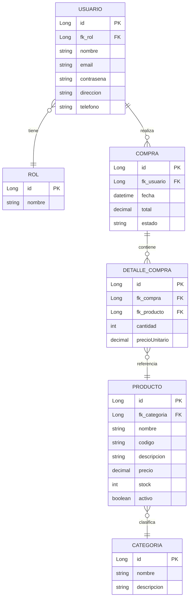

# G4-ms - PetStore E-Commerce Backend

Backend del proyecto Pet Store para la capacitación impartida por GoTechy.

## 📋 Descripción del Módulo E-Commerce

Este módulo implementa un sistema de **e-commerce** completo para una tienda de mascotas, con las siguientes funcionalidades:

### Funcionalidades Principales

| Módulo | Descripción |
|--------|-------------|
| **Productos** | Gestión de productos con código único, precios, stock y categorías |
| **Categorías** | Organización de productos por categorías |
| **Carrito de Compras** | Agregar, modificar y eliminar items del carrito |
| **Compras** | Proceso completo de compra con validación de stock |
| **Usuarios** | Sistema de usuarios con roles (CLIENTE, ADMIN) |
| **Autenticación** | JWT-based authentication |

### Modelo de Datos



## 🚀 Inicio Rápido

### Requisitos

- Java 21+
- Maven 3.8+
- PostgreSQL 15+
- Docker (opcional)

### Configuración

1. **Variables de entorno:**
```bash
export JWT_SECRET=PETSHOP_SECRET_KEY_256_BITS_MIN_FOR_HS256_ALGORITHM_2026
```

2. **Base de datos PostgreSQL:**
```bash
# Usando Docker
docker run -d \
  --name petshop_db \
  -e POSTGRES_DB=petshop_ecommerce \
  -e POSTGRES_USER=petshop_admin \
  -e POSTGRES_PASSWORD=petshop_secure_pass \
  -p 5432:5432 \
  postgres:15
```

3. **Ejecutar la aplicación:**
```bash
./mvnw spring-boot:run
```

### Endpoints Principales

| Método | Ruta | Descripción | Auth |
|--------|------|-------------|------|
| POST | `/auth/register` | Registro de usuario | No |
| POST | `/auth/login` | Inicio de sesión | No |
| GET | `/productos` | Listar productos | No |
| GET | `/productos/{id}` | Obtener producto | No |
| POST | `/productos` | Crear producto | ADMIN |
| PUT | `/productos/{id}` | Actualizar producto | ADMIN |
| DELETE | `/productos/{id}` | Eliminar producto | ADMIN |
| GET | `/categorias` | Listar categorías | No |
| POST | `/compras` | Crear compra | CLIENTE |

### Documentación API (Swagger)

Una vez iniciada la aplicación:
- **Swagger UI:** http://localhost:8080/swagger-ui.html
- **OpenAPI JSON:** http://localhost:8080/api-docs

## 🛠️ Tecnologías

| Tecnología | Versión |
|------------|---------|
| Spring Boot | 3.4.13 |
| Java | 21 (LTS) |
| Spring Security | JWT |
| Spring Data JPA | - |
| PostgreSQL | 15 |
| Flyway | - |
| Swagger/OpenAPI | 2.8.4 |

## 📁 Estructura del Proyecto

```
src/main/java/com/team4/petstore/
├── config/           # Configuraciones (Security, OpenAPI, Web)
├── controller/       # Controladores REST
├── dto/              # Data Transfer Objects
│   ├── request/      # DTOs de entrada
│   └── response/    # DTOs de salida
├── entity/          # Entidades JPA
├── exception/       # Excepciones personalizadas
├── repository/      # Repositorios JPA
├── security/        # Filtros JWT y configuración de seguridad
└── service/         # Lógica de negocio
```
