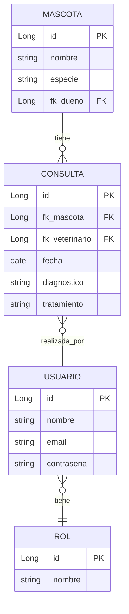

# G4-ms - PetStore E-Commerce Backend

Backend del proyecto Pet Store para la capacitación impartida por GoTechy.

## 📋 Descripción del Módulo Veterinaria
Este módulo implementa la gestión de historial clínico de mascotas y consultas médicas dentro del sistema, con control de acceso por roles.

### Funcionalidades Principales
|--------|-------------|
| Módulo |	Descripción|
|--------|-------------|
|Mascotas |	Gestión de mascotas con datos básicos y vínculo con su dueño|
|Consultas	| Registro de consultas médicas con diagnóstico, tratamiento y fecha|
|Historial Clínico	| Listado paginado de consultas asociadas a cada mascota|
|Veterinarios	| Gestión de usuarios con rol de veterinario|
|Autenticación y Roles	| Control de acceso mediante JWT y roles (ADMIN, VETERINARIO)|

### Modelo de Datos


## 🚀 Inicio Rápido
Requisitos  
- Java 21+
- Maven 3.8+
- PostgreSQL 15+
- Docker / WSL2 (opcional)

### Configuración
1. **Variables de entorno:**

```bash
export JWT_SECRET=VETERINARIA_SECRET_KEY_256_BITS_2026
```

2. Base de datos PostgreSQL:

```bash
docker run -d \
  --name vet_db \
  -e POSTGRES_DB=vet_clinic \
  -e POSTGRES_USER=vet_admin \
  -e POSTGRES_PASSWORD=vet_secure_pass \
  -p 5432:5432 \
  postgres:15
```

3. Ejecutar la aplicación:

```bash
./mvnw spring-boot:run
```

### 🔗 Endpoints Principales
|Método|	Ruta|	Descripción|	Auth|
|------|--------|--------------|--------|
|GET   | /api/v1/mascotas/{id}/historial-clinico |	Listar historial clínico de una mascota	| ADMIN, VETERINARIO |
|POST  | /api/v1/consultas	| Registrar nueva consulta	| ADMIN, VETERINARIO |
|PUT   | /api/v1/consultas/{id}	| Actualizar consulta	| ADMIN, VETERINARIO |
|DELETE|	/api/v1/consultas/{id}	| Eliminar consulta	| ADMIN |

**Ejemplo de respuesta:**

```json
{
  "content": [
    {
      "id": 12,
      "fecha": "2026-06-18",
      "diagnostico": "Otitis",
      "tratamiento": "Antibióticos",
      "veterinario": "Dr. López"
    }
  ],
  "totalElements": 1,
  "totalPages": 1
}
```

### 📖 Documentación API (Swagger)
Una vez iniciada la aplicación:
- Swagger UI: http://localhost:8080/swagger-ui.html
- OpenAPI JSON: http://localhost:8080/api-docs

## 🛠️ Tecnologías
| Tecnología	| Versión |
|---------------|---------|
|Spring Boot	| 4.1.0|
|Java	| 21 (LTS)|
|Spring Security	| JWT|
|Spring Data JPA	| -|
|PostgreSQL |	15|
|Flyway	| -|
|Swagger/OpenAPI |	2.8.4|


## 📁 Estructura del Proyecto
```
src/main/java/com/team4/petstore/
├── config/           # Configuraciones (Security, OpenAPI, Web)
├── controller/       # Controladores REST (MascotaHistorialController, ConsultaController)
├── dto/              # Data Transfer Objects
│   ├── request/      # DTOs de entrada (ConsultaRequestDTO)
│   └── response/     # DTOs de salida (ConsultaResponseDTO)
├── entity/           # Entidades JPA (Mascota, Consulta, Usuario, Rol)
├── exception/        # Excepciones personalizadas
├── repository/       # Repositorios JPA
├── security/         # Filtros JWT y configuración de seguridad
└── service/          # Lógica de negocio (ConsultaService, MascotaService)
```
