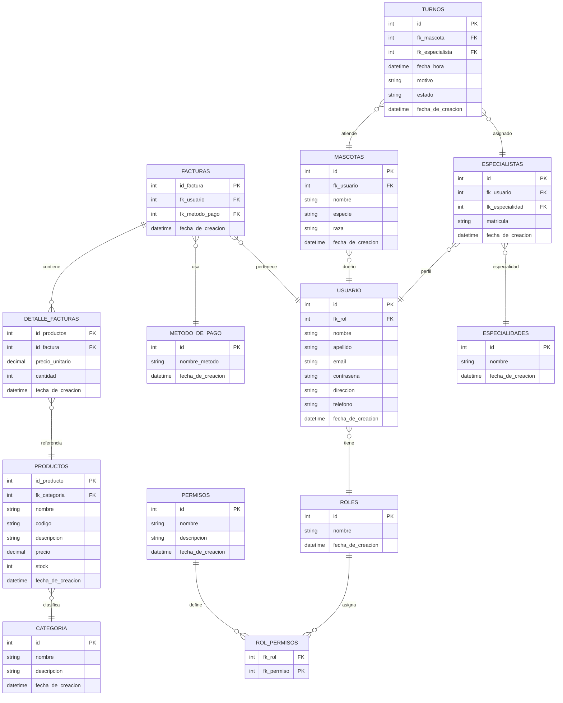

# G4-ms
Backend del proyecto Pet Store para la capacitación impartida por GoTechy

# 📑 Documentación General – Tienda de mascotas
## 1. Introducción
Este documento describe la arquitectura general del sistema de Tienda de mascotas, incluyendo las entidades principales, complementarias y sus relaciones.  
El objetivo es proveer una visión integral que sirva como referencia para el desarrollo, mantenimiento y evolución del sistema.

## 2. Alcance
El sistema abarca:  
**Facturación**: emisión de facturas, detalle de ítems y métodos de pago.  
**Usuarios y Roles**: gestión de perfiles, permisos y autenticación.  
**Productos y Categorías**: catálogo de productos y servicios.  
**Mascotas y Especialistas**: registro de pacientes y profesionales.  
**Turnos**: agenda de citas entre mascotas y especialistas.  

## 3. Entidades Principales
- FACTURAS
- USUARIO
- ROLES
- PRODUCTOS
- CATEGORIA
- MASCOTAS
- ESPECIALISTAS
- ESPECIALIDADES
- TURNOS

## 4. Entidades Complementarias
- DETALLE_FACTURAS
- METODO_DE_PAGO
- ROL_PERMISOS
- PERMISOS

## 5. Relaciones Clave
Una **Factura** contiene múltiples **DetalleFactura**.  
Una **Factura** pertenece a un Usuario y usa un Método de Pago.  
Un **Usuario** tiene un **Rol**, y los roles se vinculan a **Permisos** mediante **RolPermisos**.  
Un **Producto** se clasifica en una **Categoría**.  
Una **Mascota** pertenece a un **Usuario**.  
Un **Especialista** está vinculado a un **Usuario** y a una **Especialidad**.  
Un **Turno** atiende a una **Mascota** y es asignado a un **Especialista**.

## 6. Diagrama de Clases UML

## 7. Procesos Generales
- Facturación
    - Selección de productos.  
    - Generación de detalle de factura.  
    - Asociación de método de pago.  
    - Emisión de factura.  
- Gestión de Turnos  
    - Solicitud de cita por parte del usuario.  
    - Selección de especialista según especialidad.  
    - Registro del turno con fecha/hora y estado.  
    - Notificación al usuario.  

## 8. Anexos
### Glosario

**Factura**: comprobante de transacción.  
**Turno**: cita veterinaria.  
**Rol**: perfil de acceso.  
**Permiso**: acción habilitada en el sistema.
