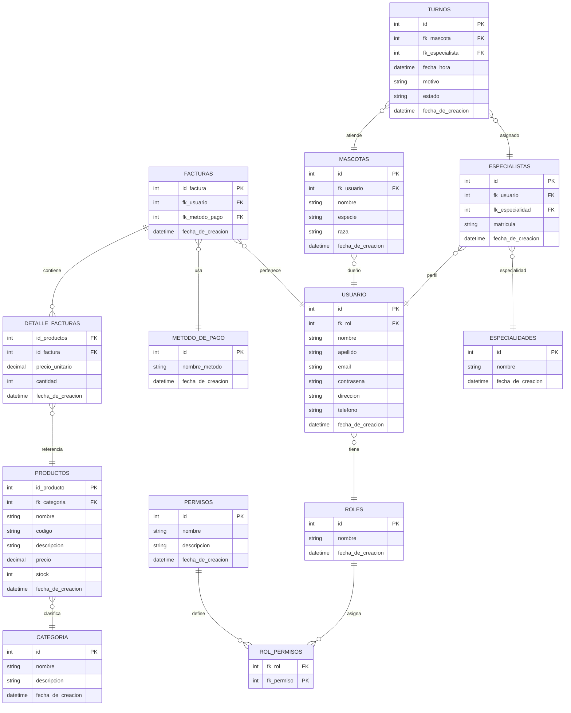

# G4-ms
Backend del proyecto Pet Store para la capacitación impartida por GoTechy

```mermaid
erDiagram
    DETALLE_FACTURAS {
        int id_productos FK
        int id_factura FK
        decimal precio_unitario
        int cantidad
        datetime fecha_de_creacion
    }
    METODO_DE_PAGO {
        int id PK
        string nombre_metodo
        datetime fecha_de_creacion
    }
    FACTURAS {
        int id_factura PK
        int fk_usuario FK
        int fk_metodo_pago FK
        datetime fecha_de_creacion
    }
    USUARIO {
        int id PK
        int fk_rol FK
        string nombre
        string apellido
        string email
        string contrasena
        string direccion
        string telefono
        datetime fecha_de_creacion
    }
    ROLES {
        int id PK
        string nombre
        datetime fecha_de_creacion
    }
    ROL_PERMISOS {
        int fk_rol FK
        int fk_permiso PK
    }
    PERMISOS {
        int id PK
        string nombre
        string descripcion
        datetime fecha_de_creacion
    }
    PRODUCTOS {
        int id_producto PK
        int fk_categoria FK
        string nombre
        string codigo
        string descripcion
        decimal precio
        int stock
        datetime fecha_de_creacion
    }
    CATEGORIA {
        int id PK
        string nombre
        string descripcion
        datetime fecha_de_creacion
    }
    MASCOTAS {
        int id PK
        int fk_usuario FK
        string nombre
        string especie
        string raza
        datetime fecha_de_creacion
    }
    ESPECIALIDADES {
        int id PK
        string nombre
        datetime fecha_de_creacion
    }
    ESPECIALISTAS {
        int id PK
        int fk_usuario FK
        int fk_especialidad FK
        string matricula
        datetime fecha_de_creacion
    }
    TURNOS {
        int id PK
        int fk_mascota FK
        int fk_especialista FK
        datetime fecha_hora
        string motivo
        string estado
        datetime fecha_de_creacion
    }

    FACTURAS ||--o{ DETALLE_FACTURAS : contiene
    FACTURAS }o--|| METODO_DE_PAGO : usa
    FACTURAS }o--|| USUARIO : pertenece
    USUARIO }o--|| ROLES : tiene
    ROLES ||--o{ ROL_PERMISOS : asigna
    PERMISOS ||--o{ ROL_PERMISOS : define
    PRODUCTOS }o--|| CATEGORIA : clasifica
    DETALLE_FACTURAS }o--|| PRODUCTOS : referencia
    MASCOTAS }o--|| USUARIO : dueño
    ESPECIALISTAS }o--|| USUARIO : perfil
    ESPECIALISTAS }o--|| ESPECIALIDADES : especialidad
    TURNOS }o--|| MASCOTAS : atiende
    TURNOS }o--|| ESPECIALISTAS : asignado
```
