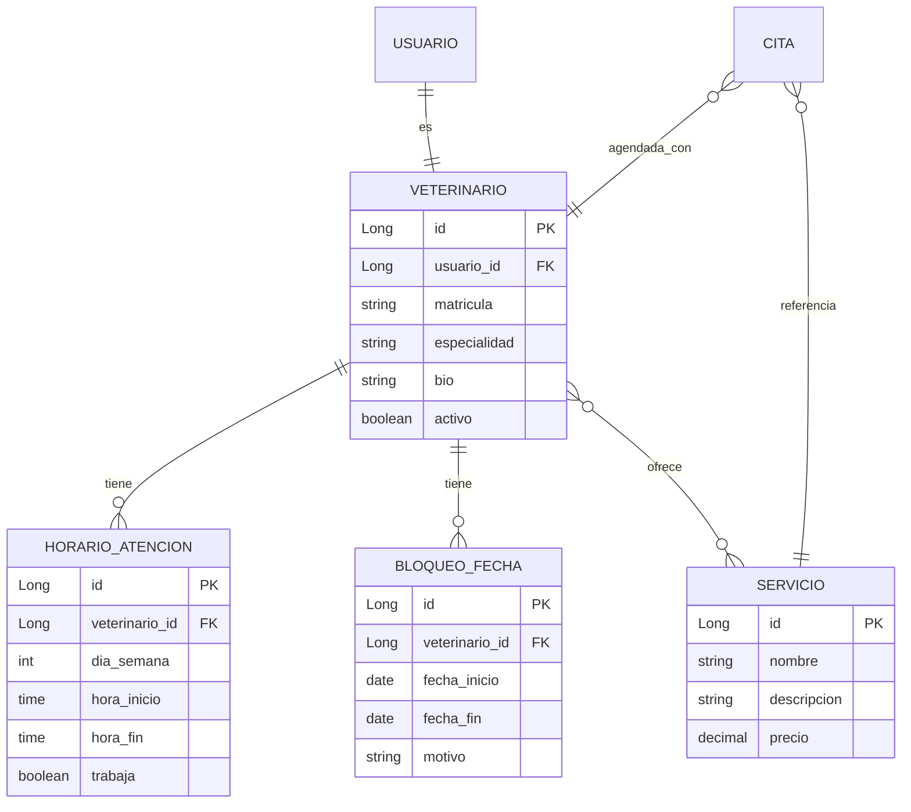
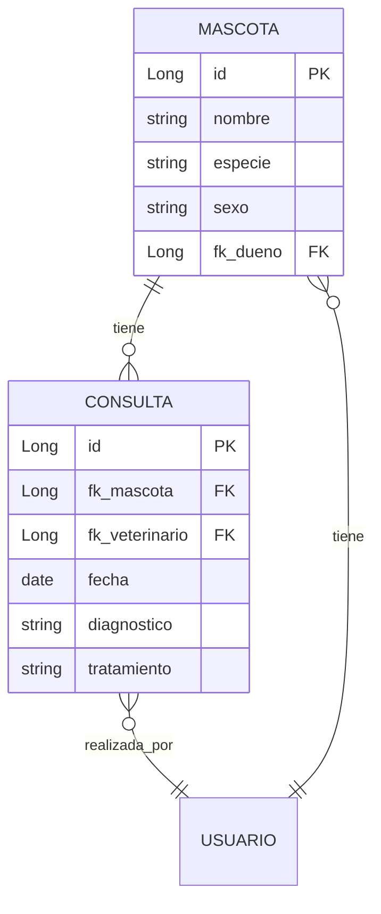
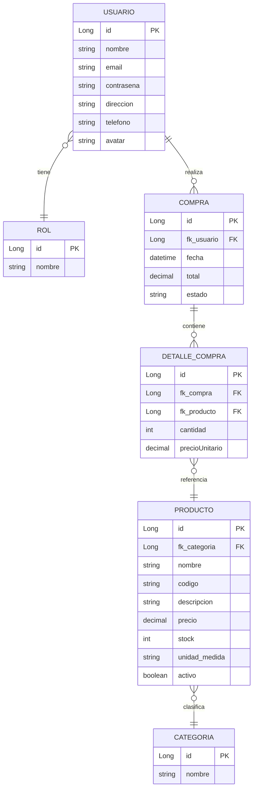
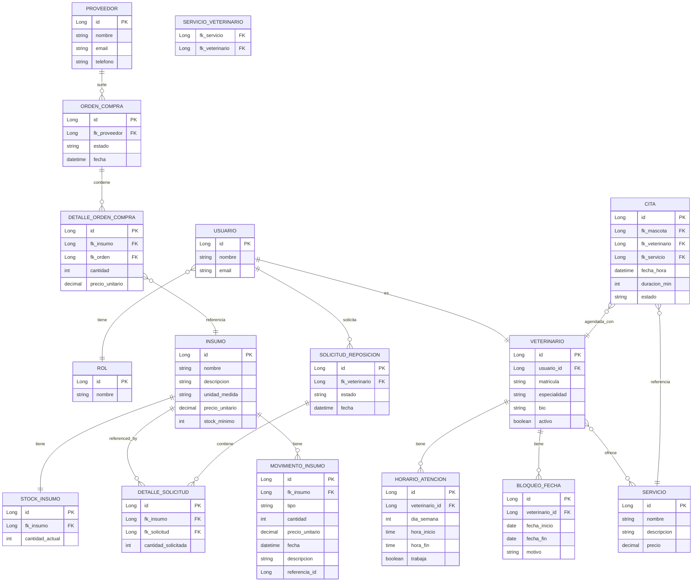

# G4-ms - PetStore E-Commerce Backend

Backend del proyecto Pet Store para la capacitación impartida por GoTechy.

## 📋 Descripción del Proyecto

Este proyecto implementa un sistema completo de **e-commerce** y **gestión veterinaria** para una tienda de mascotas, con tres módulos principales:

| Módulo | Descripción |
|--------|-------------|
| **E-Commerce** | Gestión de productos, compras y usuarios (CLIENTE, ADMIN) |
| **Gestión Veterinaria** | Gestión de historial clínico, consultas, citas, internaciones, servicios y veterinarios (VETERINARIO, ADMIN) |
| **Vet-Stock** | Gestión de insumos médicos, stock, solicitudes y órdenes de compra (VETERINARIO, ADMIN) |

> **🔄 Refactor reciente:** El módulo de veterinarios implementa la **Opción A** del modelo de servicios. Se consolidó `Servicio` (entidad comercial) como única fuente de verdad para "qué ofrece un veterinario" y "qué se agenda en una cita". Anteriormente existía un enum `TipoCita` que se usaba para ambos propósitos, generando duplicación. Ahora `Cita.servicio` es una relación `ManyToOne` a `Servicio`, y `Veterinario.servicios` es una relación `ManyToMany` con `Servicio`. Esto garantiza que un cliente no pueda agendar un servicio que el veterinario no ofrece.

---

## 🏥 Módulo de Gestión Veterinaria (Sv-Veterinaria)

### Descripción

Este módulo implementa la gestión de historial clínico de mascotas, consultas médicas, citas e internaciones dentro del sistema, con control de acceso por roles.

---

## 👨‍⚕️ Módulo de Administración de Veterinarios (Vet-Admin)

### Descripción

Este módulo permite a los **administradores** gestionar el alta, edición y disponibilidad de los veterinarios registrados en el sistema. Los veterinarios se asocian al catálogo de `Servicios` (entidad comercial con precio) que pueden ofrecer, garantizando consistencia con las citas agendadas.

### Funcionalidades Principales

| Funcionalidad | Descripción |
|---------------|-------------|
| **Veterinarios** | CRUD completo de veterinarios con datos de cuenta y perfil profesional |
| **Servicios Ofrecidos** | Asocia el veterinario a los `Servicios` del catálogo que puede ofrecer (Many-to-Many) |
| **Horarios de Atención** | Configuración semanal de horarios (Lunes a Domingo) |
| **Bloqueos de Fecha** | Registro de vacaciones/ausencias que bloquean automáticamente la agenda |

### Modelo de Datos (Vet-Admin)



### Endpoints Principales (Vet-Admin)

| Método | Ruta | Descripción | Auth |
|--------|------|-------------|------|
| GET | `/api/v1/veterinarios` | Listar veterinarios activos | ADMIN |
| GET | `/api/v1/veterinarios/todos` | Listar todos los veterinarios | ADMIN |
| GET | `/api/v1/veterinarios/{id}` | Obtener veterinario por ID | ADMIN |
| POST | `/api/v1/veterinarios` | Crear veterinario | ADMIN |
| PUT | `/api/v1/veterinarios/{id}` | Actualizar veterinario | ADMIN |
| DELETE | `/api/v1/veterinarios/{id}` | Eliminar veterinario (soft delete) | ADMIN |
| PATCH | `/api/v1/veterinarios/{id}/activo` | Activar/Desactivar veterinario | ADMIN |
| GET | `/api/v1/veterinarios/{id}/horarios` | Listar horarios | ADMIN |
| PUT | `/api/v1/veterinarios/{id}/horarios` | Actualizar horarios (7 días) | ADMIN |
| GET | `/api/v1/veterinarios/{id}/bloqueos` | Listar bloqueos | ADMIN |
| POST | `/api/v1/veterinarios/{id}/bloqueos` | Crear bloqueo | ADMIN |
| DELETE | `/api/v1/veterinarios/{id}/bloqueos/{bloqueoId}` | Eliminar bloqueo | ADMIN |

### Ejemplo: Crear Veterinario

```json
POST /api/v1/veterinarios
{
  "nombre": "Juan",
  "apellido": "Perez",
  "email": "juan.perez@petstore.com",
  "password": "securePassword123",
  "telefono": "351-555-1234",
  "matricula": "VET-2024-001",
  "especialidad": "Cirugía General",
  "bio": "Médico veterinario con más de 10 años de experiencia en cirugía general y emergencia.",
  "servicioIds": [1, 2, 3]
}
```

> **Nota:** Los `servicioIds` deben corresponder a IDs de `Servicios` existentes en el catálogo (creados vía `POST /api/v1/servicios`).

### Validación de Negocio (Cita ↔ Veterinario ↔ Servicio)

Cuando se agenda una cita, el sistema valida que el veterinario esté asociado al servicio solicitado:

```java
if (!veterinario.getServicios().contains(servicio)) {
    throw new BadRequestException("El veterinario no ofrece este servicio");
}
```

Esto garantiza que un cliente no pueda agendar, por ejemplo, una cirugía con un veterinario que solo ofrece consultas.

### Ejemplo: Actualizar Horarios

```json
PUT /api/v1/veterinarios/1/horarios
{
  "horarios": [
    { "diaSemana": 1, "trabaja": true, "horaInicio": "08:00", "horaFin": "12:00" },
    { "diaSemana": 1, "trabaja": true, "horaInicio": "14:00", "horaFin": "18:00" },
    { "diaSemana": 2, "trabaja": true, "horaInicio": "08:00", "horaFin": "16:00" },
    { "diaSemana": 3, "trabaja": true, "horaInicio": "08:00", "horaFin": "16:00" },
    { "diaSemana": 4, "trabaja": true, "horaInicio": "08:00", "horaFin": "16:00" },
    { "diaSemana": 5, "trabaja": true, "horaInicio": "08:00", "horaFin": "14:00" },
    { "diaSemana": 6, "trabaja": false },
    { "diaSemana": 7, "trabaja": false }
  ]
}
```

### Ejemplo: Crear Bloqueo de Vacaciones

```json
POST /api/v1/veterinarios/1/bloqueos
{
  "fechaInicio": "2024-07-10",
  "fechaFin": "2024-07-15",
  "motivo": "Vacaciones anuales"
}
```

---

### Funcionalidades Principales

| Funcionalidad | Descripción |
|---------------|-------------|
| **Mascotas** | Gestión de mascotas con datos básicos y vínculo con su dueño |
| **Historial Clínico** | Listado paginado de consultas asociadas a cada mascota |
| **Consultas** | Registro de consultas médicas con diagnóstico, tratamiento y fecha |
| **Citas** | Gestión de citas con validación de horarios no superpuestos |
| **Internaciones** | Control de internaciones con evoluciones registradas |
| **Prescripciones** | Gestión de prescripciones médicas vinculadas a consultas |

### Modelo de Datos (Veterinaria)



### Endpoints Principales (Sv-Veterinaria)

| Método | Ruta | Descripción | Auth |
|--------|------|-------------|------|
| GET | `/api/v1/mascotas/{id}/historial-clinico` | Listar historial clínico | ADMIN, VETERINARIO |
| POST | `/api/v1/consultas` | Registrar nueva consulta | ADMIN, VETERINARIO |
| PUT | `/api/v1/consultas/{id}` | Actualizar consulta | ADMIN, VETERINARIO |
| DELETE | `/api/v1/consultas/{id}` | Eliminar consulta | ADMIN |
| POST | `/api/v1/citas` | Crear cita (valida que el veterinario ofrezca el servicio) | ADMIN, VETERINARIO |
| GET | `/api/v1/citas/veterinario/{id}/mes?anio=&mes=` | Agenda del mes | ADMIN, VETERINARIO |
| POST | `/api/v1/internaciones` | Crear internación | ADMIN, VETERINARIO |
| PUT | `/api/v1/internaciones/{id}/evolucion` | Agregar evolución | ADMIN, VETERINARIO |

### Ejemplo: Crear Cita

```json
POST /api/v1/citas
{
  "mascotaId": 1,
  "veterinarioId": 5,
  "servicioId": 2,
  "fechaHora": "2026-07-15T10:00:00",
  "duracionMinutos": 30,
  "notas": "Control de rutina"
}
```

---

## 📦 Módulo E-Commerce

### Funcionalidades Principales

| Funcionalidad | Descripción |
|---------------|-------------|
| **Productos** | Gestión de productos con código único, precios, stock y categorías |
| **Categorías** | Organización de productos por categorías |
| **Carrito de Compras** | Agregar, modificar y eliminar items del carrito |
| **Compras** | Proceso completo de compra con validación de stock |
| **Usuarios** | Sistema de usuarios con roles (CLIENTE, ADMIN) |
| **Autenticación** | JWT-based authentication |
| **Estado de Compras** | ADMIN puede cambiar estado (PENDIENTE → CONFIRMADO → ENTREGADO, o CANCELADO) |
| **Stock Automático** | Al cancelar compra, el stock se restaura automáticamente |

---

## 🏥 Módulo de Gestión Veterinaria (Vet-Stock)

### Descripción

Este módulo permite a los **veterinarios** gestionar los insumos médicos de la clínica, solicitando reposición cuando el stock está bajo. Los **administradores** aprobam las solicitudes y gestionan las órdenes de compra a proveedores.

### Roles y Permisos

| Rol | Permisos |
|-----|----------|
| **VETERINARIO** | Ver stock, crear solicitudes de reposición, registrar consumo de insumos |
| **ADMIN** | Todas las anteriores + crear/editar insumos, aprobar/cancelar solicitudes, gestionar proveedores, completar/cancelar órdenes |

### Flujo de Trabajo

```
┌─────────────┐     Solicita      ┌─────────────┐     Aprueba      ┌─────────────┐
│  VETERINARIO │ ───────────────► │  SOLICITUD   │ ───────────────► │   ORDEN     │
│              │                  │  (PENDIENTE)  │                  │  COMPRA     │
└─────────────┘                  └─────────────┘                  │ (PENDIENTE)  │
                                                                    └──────┬──────┘
                                                                           │
                                                                   ┌───────▼───────┐
                                                                   │  ADMIN recibe  │
                                                                   │  mercadería   │
                                                                   └───────┬───────┘
                                                                           │
                                                            ┌──────────────▼──────────────┐
                                                            │ COMPLETAR orden             │
                                                            │ - Actualiza precios reales  │
                                                            │ - Aumenta stock             │
                                                            │ - Registra movimientos     │
                                                            └────────────────────────────┘

┌─────────────┐     Registra      ┌─────────────┐
│  VETERINARIO │ ───────────────► │   STOCK      │
│              │     consumo       │  (disminuye) │
└─────────────┘                  └─────────────┘
```

### Entidades Principales

| Entidad | Descripción |
|---------|-------------|
| **Insumo** | Catálogo de productos médicos (nombre, descripción, unidad, precio, stock mínimo) |
| **StockInsumo** | Stock actual de cada insumo |
| **MovimientoInsumo** | Historial de entradas y salidas (con cantidad, precio, fecha, descripción) |
| **SolicitudReposicion** | Solicitud del veterinario para reponer insumos |
| **DetalleSolicitud** | Ítems solicitados (insumo + cantidad) |
| **OrdenCompra** | Orden de compra al proveedor |
| **DetalleOrdenCompra** | Ítems de la orden (con precio real acordado) |
| **Proveedor** | Datos del proveedor (nombre, email, teléfono) |

### Estados

| Entidad | Estados |
|---------|---------|
| **SolicitudReposicion** | `PENDIENTE` → `APROBADA` o `CANCELADA` |
| **OrdenCompra** | `PENDIENTE` → `COMPLETADA` o `CANCELADA` |
| **MovimientoInsumo** | `ENTRADA` (compra) o `SALIDA` (consumo) |

### Lógica de Negocio

1. **Crear Insumo (ADMIN):** Al crear un insumo, automáticamente se crea un registro de stock en 0.

2. **Solicitar Reposición (VET):** El veterinario crea una solicitud con los insumos y cantidades necesitadas (sin especificar precio).

3. **Aprobar Solicitud (ADMIN):** El admin selecciona un proveedor y se genera automáticamente una `OrdenCompra` en estado `PENDIENTE`.

4. **Completar Orden (ADMIN):** Cuando llega la mercadería:
   - El admin puede ajustar los precios reales (que pueden diferir de los estimados)
   - El precio del insumo se actualiza con el precio real
   - El stock aumenta según las cantidades recibidas
   - Se registran los movimientos de entrada

5. **Registrar Consumo (VET):** El veterinario registra cuando usa insumos en una consulta:
   - El stock disminuye
   - Se registra el movimiento de salida

### Alertas de Stock

El endpoint de stock incluye un campo `alertaStock` que indica `true` cuando `cantidadActual <= stockMinimo`, permitiendo mostrar alertas en el frontend.

---

## 🚀 Inicio Rápido

### Requisitos

- Java 21+
- Maven 3.8+
- PostgreSQL 15+
- Docker (opcional)

### Configuración

1. **Variables de entorno:**
```bash
export JWT_SECRET=PETSHOP_SECRET_KEY_256_BITS_MIN_FOR_HS256_ALGORITHM_2026
export CLOUDINARY_CLOUD_NAME=your_cloud_name
export CLOUDINARY_API_KEY=your_api_key
export CLOUDINARY_API_SECRET=your_api_secret
```

2. **Base de datos PostgreSQL:**
```bash
# Usando Docker
docker run -d \
  --name petshop_db \
  -e POSTGRES_DB=petshop_ecommerce \
  -e POSTGRES_USER=petshop_admin \
  -e POSTGRES_PASSWORD=petshop_secure_pass \
  -p 5432:5432 \
  postgres:15
```

3. **Ejecutar la aplicación:**
```bash
./mvnw spring-boot:run
```

---

## 👤 Usuarios de Prueba (Seeds)

Al iniciar la aplicación, se crean automáticamente los siguientes usuarios:

| Email | Password | Rol |
|-------|----------|-----|
| `admin@petshop.com` | `12345678` | ADMIN |
| `doctor@petshop.com` | `12345678` | VETERINARIO |
| `cliente@petshop.com` | `12345678` | CLIENTE |

> **Nota:** El usuario CLIENTE tiene 2 mascotas de prueba (Max - Perro, Nube - Gato)

---

## 📚 Endpoints API

### Autenticación

| Método | Ruta | Descripción | Auth |
|--------|------|-------------|------|
| POST | `/auth/register` | Registro de usuario | No |
| POST | `/auth/login` | Inicio de sesión | No |

### Productos (E-Commerce)

| Método | Ruta | Descripción | Auth |
|--------|------|-------------|------|
| GET | `/productos` | Listar productos | No |
| GET | `/productos/{id}` | Obtener producto | No |
| POST | `/productos` | Crear producto | ADMIN |
| PUT | `/productos/{id}` | Actualizar producto | ADMIN |
| DELETE | `/productos/{id}` | Eliminar producto | ADMIN |

### Categorías

| Método | Ruta | Descripción | Auth |
|--------|------|-------------|------|
| GET | `/categorias` | Listar categorías | No |

### Compras

| Método | Ruta | Descripción | Auth |
|--------|------|-------------|------|
| GET | `/compras` | Historial de compras del usuario autenticado | CLIENTE |
| GET | `/compras/usuario/{usuarioId}` | Historial de compras de un usuario específico | ADMIN |
| POST | `/compras` | Crear compra | CLIENTE |
| PUT | `/compras/{id}/estado?estado=` | Cambiar estado | ADMIN |

### Gestión de Insumos (Vet-Stock)

#### Insumos (ADMIN)

| Método | Ruta | Descripción | Auth |
|--------|------|-------------|------|
| GET | `/insumos` | Listar insumos | ADMIN |
| GET | `/insumos/{id}` | Obtener insumo | ADMIN |
| POST | `/insumos` | Crear insumo | ADMIN |
| PUT | `/insumos/{id}` | Actualizar insumo | ADMIN |
| DELETE | `/insumos/{id}` | Eliminar insumo | ADMIN |

#### Stock (VET, ADMIN)

| Método | Ruta | Descripción | Auth |
|--------|------|-------------|------|
| GET | `/insumos/stock` | Ver stock de todos los insumos | VET, ADMIN |
| GET | `/insumos/stock/{id}` | Ver stock de un insumo | VET, ADMIN |
| GET | `/insumos/stock/{id}/historial` | Ver historial de movimientos | VET, ADMIN |
| GET | `/insumos/stock/disponibles` | Stock para mostrar en frontend | No |

#### Solicitudes de Reposición

| Método | Ruta | Descripción | Auth |
|--------|------|-------------|------|
| GET | `/solicitudes` | Mis solicitudes | VET |
| GET | `/solicitudes/todas` | Todas las solicitudes | ADMIN |
| GET | `/solicitudes/{id}` | Ver solicitud | VET, ADMIN |
| GET | `/solicitudes/veterinario/{id}` | Solicitudes de un veterinario | ADMIN |
| POST | `/solicitudes` | Crear solicitud | VET |
| PUT | `/solicitudes/{id}/aprobar?proveedorId=` | Aprobar y generar orden | ADMIN |
| PUT | `/solicitudes/{id}/cancelar` | Cancelar solicitud | ADMIN |

#### Órdenes de Compra (ADMIN)

| Método | Ruta | Descripción | Auth |
|--------|------|-------------|------|
| GET | `/ordenes-compra` | Listar órdenes | ADMIN |
| GET | `/ordenes-compra/{id}` | Ver orden | ADMIN |
| **POST** | **`/ordenes-compra`** | **Crear orden de compra** | **ADMIN** |
| PUT | `/ordenes-compra/{id}/completar` | Completar orden (recibe mercadería) | ADMIN |
| PUT | `/ordenes-compra/{id}/cancelar` | Cancelar orden | ADMIN |

#### Proveedores (ADMIN)

| Método | Ruta | Descripción | Auth |
|--------|------|-------------|------|
| GET | `/proveedores` | Listar proveedores | ADMIN |
| GET | `/proveedores/{id}` | Ver proveedor | ADMIN |
| POST | `/proveedores` | Crear proveedor | ADMIN |
| PUT | `/proveedores/{id}` | Actualizar proveedor | ADMIN |
| DELETE | `/proveedores/{id}` | Eliminar proveedor | ADMIN |

#### Consumo de Insumos (VET)

| Método | Ruta | Descripción | Auth |
|--------|------|-------------|------|
| POST | `/insumos/consumo` | Registrar consumo de insumos | VET |

### Ejemplo: Crear Solicitud de Reposición

```json
POST /solicitudes
{
  "detalles": [
    { "insumoId": 1, "cantidadSolicitada": 50 },
    { "insumoId": 3, "cantidadSolicitada": 20 }
  ]
}
```

### Ejemplo: Aprobar Solicitud

```
PUT /solicitudes/1/aprobar?proveedorId=1
```

### Ejemplo: Crear Orden de Compra directamente

```json
POST /ordenes-compra
{
  "proveedorId": 1,
  "items": [
    { "insumoId": 1, "cantidad": 50 },
    { "insumoId": 3, "cantidad": 30 }
  ]
}
```

> **Nota:** La orden se crea en estado `PENDIENTE` con precios en cero. Al completarla se actualizan precios reales y stock.

### Ejemplo: Completar Orden (con precios reales)

```json
PUT /ordenes-compra/1/completar
{
  "items": [
    { "insumoId": 1, "cantidad": 50, "precioUnitario": 22.00 },
    { "insumoId": 3, "cantidad": 20, "precioUnitario": 28.50 }
  ]
}
```

### Ejemplo: Registrar Consumo

```json
POST /insumos/consumo
{
  "items": [
    { "insumoId": 1, "cantidad": 2 }
  ],
  "descripcion": "Consulta de revisión general - Luna"
}
```

---

## 📊 Modelo de Datos (E-Commerce)



## 📊 Modelo de Datos (Gestión Veterinaria)



---

## 📁 Estructura del Proyecto

```
src/main/java/com/team4/petstore/
├── config/              # Configuraciones (Security, OpenAPI, Cloudinary, DataSeeder)
├── controller/          # Controladores REST
│   ├── AuthController.java
│   ├── CategoriaController.java
│   ├── CompraController.java
│   ├── ImageController.java
│   ├── ProductoController.java
│   ├── UsuarioController.java
│   ├── MascotaController.java
│   ├── MascotaHistorialController.java
│   ├── ConsultaController.java
│   ├── CitaController.java
│   ├── InternacionController.java
│   ├── InsumoController.java
│   ├── StockInsumoController.java
│   ├── SolicitudReposicionController.java
│   ├── OrdenCompraController.java
│   ├── ProveedorController.java
│   ├── ServicioController.java
│   └── VeterinarioController.java       # Vet-Admin
├── dto/
│   ├── request/        # DTOs de entrada
│   │   ├── VeterinarioRequest.java
│   │   ├── VeterinarioCuentaRequest.java
│   │   ├── VeterinarioPerfilRequest.java
│   │   ├── HorarioRequest.java
│   │   ├── BloqueoFechaRequest.java
│   │   ├── CambiarEstadoRequest.java
│   │   ├── CitaRequest.java
│   │   └── ServicioRequest.java
│   └── response/       # DTOs de salida
│       ├── VeterinarioResponse.java
│       ├── HorarioResponse.java
│       ├── BloqueoFechaResponse.java
│       ├── CitaResponse.java
│       └── ServicioResponse.java
├── entity/             # Entidades JPA
│   ├── Usuario.java, Rol.java, Producto.java
│   ├── Categoria.java, Compra.java, DetalleCompra.java
│   ├── Mascota.java, Consulta.java, Cita.java
│   ├── Insumo.java, StockInsumo.java, MovimientoInsumo.java
│   ├── SolicitudReposicion.java, DetalleSolicitud.java
│   ├── OrdenCompra.java, DetalleOrdenCompra.java
│   ├── Proveedor.java, Internacion.java, Prescripcion.java
│   ├── Servicio.java                       # Catálogo comercial
│   ├── Veterinario.java, HorarioAtencion.java, BloqueoFecha.java  # Vet-Admin
│   └── enums: EstadoCompra, TipoMovimiento, EstadoSolicitud, EstadoCita, TipoCita, etc.
├── exception/         # Excepciones personalizadas
├── repository/         # Repositorios JPA
│   ├── VeterinarioRepository.java
│   ├── HorarioAtencionRepository.java   # Vet-Admin
│   ├── BloqueoFechaRepository.java       # Vet-Admin
│   └── ServicioRepository.java
├── security/           # Filtros JWT y configuración de seguridad
├── service/           # Lógica de negocio
│   ├── VeterinarioService.java          # Vet-Admin
│   ├── ServicioService.java
│   └── CitaService.java                  # Valida veterinario.tieneServicio()
└── event/             # Eventos de dominio (citas, evoluciones)
```

---

## 🛠️ Tecnologías

| Tecnología | Versión |
|------------|---------|
| Spring Boot | 3.4.13 |
| Java | 21 (LTS) |
| Spring Security | JWT |
| Spring Data JPA | - |
| PostgreSQL | 15 |
| Flyway | - |
| Swagger/OpenAPI | 2.8.4 |
| Cloudinary | cloudinary-http45 (HTTP API) |

---

## 📖 Documentación API (Swagger)

Una vez iniciada la aplicación:
- **Swagger UI:** http://localhost:8080/swagger-ui.html
- **OpenAPI JSON:** http://localhost:8080/api-docs
